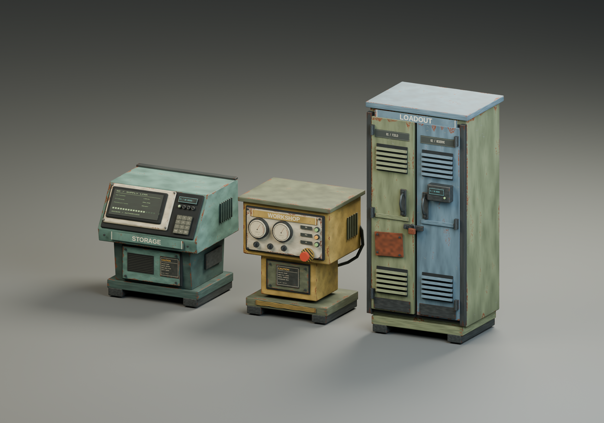

# NearbyCraft custom block family

Original Blender models for the Storage Console, Workshop Controller and Loadout
Locker. Designed as scavenged industrial equipment for 7 Days to Die V3.2: folded
painted steel, worn enamel, localized edge corrosion, analog controls, dim displays,
bolted repairs and functional hardware. The console has four tier variants.



**Status:** models, textures, FBX exports, source and renders are complete and
validated in Blender. The NearbyCraft mod now uses the DeepBore-style runtime
mesh route: Blender-exported compressed meshes and PNG atlases are packaged with
the mod, and a narrowly scoped loader creates their prefabs in game. This avoids
the unavailable Unity Editor. A main-menu-only native render test passed for all
six assets; **world placement, interaction and save/reload still require
verification** before using this build in a main save. The Unity
project remains an optional alternative, not the active loading route.

## Files

- `NearbyCraft_Blocks.blend` — editable named parts in SOURCE collections; packed
  texture images; EXPORTS contains joined game meshes; PRESENTATION contains the
  visible lineup. Hidden game/source collections are intentionally at the origin.
- `exports/NC_*.fbx` — six variants, each with LOD0, LOD1 and LOD2, one material per
  renderer. Includes the console's four tiers, workshop and locker.
- `exports/NC_*_icon.png` — 256×256 transparent renders for the inventory.
- `textures/` — three original 2048×2048 PBR atlases: base color, tangent normal,
  roughness, metallic, emission, and Unity metallic/smoothness packing.
- `previews/` — family and individual renders of the actual exported LOD0 meshes.
- `exports/manifest.json` — triangle counts, meter bounds, root collision boxes.
- `exports/validation.json` — completed Blender and FBX verification results.
- `unity/` — Unity 2022.3.62f2 project with prefab/material/bundle builder.
- `export_runtime.py` and `prepare_runtime_textures.py` — export the six compact
  3-LOD runtime meshes and memory-bounded 1024px atlas copies into `package/`.

| Model | LOD0 triangles | LOD1 | LOD2 | Footprint |
|---|---:|---:|---:|---|
| Storage T1 | 6,424 | 3,252 | 596 | 1 × 1 × 1 block |
| Storage T2 | 6,640 | 3,400 | 596 | 1 × 1 × 1 block |
| Storage T3 | 6,748 | 3,472 | 596 | 1 × 1 × 1 block |
| Storage T4 | 6,856 | 3,546 | 596 | 1 × 1 × 1 block |
| Workshop | 8,256 | 4,720 | 514 | 1 × 1 × 1 block |
| Loadout locker | 8,940 | 5,186 | 770 | 1 × 2 × 1 block |

One Blender unit is one meter. Origin is at floor center. Blender front is -Y.
The optional FBX/Unity project and active runtime export both have +Z front;
changing that yaw turned already-placed blocks backward. The active runtime
export reflects Blender X and reverses winding so the screen text and keypad
are not mirrored. The console and
workshop use `OnlySimpleRotations` so they remain upright, as the locker already
does. Console dimensions
are approximately 0.925 × 0.865 × 0.997m;
workshop 0.844 × 0.734 × 0.992m; locker 0.931 × 0.770 × 1.942m. All fit their
existing block footprints. Repeated panels deliberately reuse trim-atlas UVs.
The titles use matching horizontal and vertical texel density, avoiding stretched
lettering on the workshop's narrow top nameplate.

These are static props: displays and tier lamps are decorative. Controls, locker
doors and padlock do not animate. The mod's existing E menus provide interaction.
One conservative root BoxCollider per prefab keeps selection and collision cheap;
it includes some air around the narrower pedestal. No runtime light components,
physics rigidbodies, high-poly collision meshes or new gameplay scripts are used.

## Rebuild the art

Use Blender 4.5 LTS, Python 3, Pillow and NumPy. The texture generator's font paths
point at the installed Liberation Sans/Mono fonts; update those paths on another OS.
From the repository root:

```bash
python3 design/game_blocks/make_textures.py
/home/brad/Applications/blender-4.5.13-linux-x64/blender -b -t 8 --python-exit-code 1 --python design/game_blocks/build_models.py
/home/brad/Applications/blender-4.5.13-linux-x64/blender -b -t 4 --python-exit-code 1 --python design/game_blocks/verify_models.py
python3 design/game_blocks/prepare_unity.py
/home/brad/Applications/blender-4.5.13-linux-x64/blender -b -t 4 --python-exit-code 1 --python design/game_blocks/export_runtime.py
python3 design/game_blocks/prepare_runtime_textures.py
```

The .blend contains packed textures and can be opened independently. FBXs need
the supplied textures and material setup; Blender procedural shaders are not used
in the game assets. Both the runtime loader and optional Unity path use the
built-in Standard shader, normal maps and metallic maps with **smoothness in
alpha**, not raw roughness. The 2K source atlases remain untouched; the 1K
runtime copies cost about 64 MiB on the GPU including mipmaps across all three
families, when all are loaded.

## Optional: build a Unity asset bundle instead

The installed player's `7DaysToDie_Data/data.unity3d` header reports
**2022.3.62f2**. Use the [matching Unity Editor release](https://unity.com/releases/editor/whats-new/2022.3.62f2)
with its standalone target module and an activated Unity license. The project's
tag/layer ordering was read from that installed player's TagManager metadata.

1. Run `python3 design/game_blocks/prepare_unity.py` after any art rebuild. This
   populates `unity/Assets/NearbyCraft`; it has already been run for this delivery.
2. Open `design/game_blocks/unity` in Unity 2022.3.62f2 with the built-in renderer.
3. Choose **NearbyCraft → Create prefabs without building** to inspect all six
   generated prefabs, or choose a **Build** menu entry to import and build together.
4. Choose **Windows bundle (including Proton)** for the Windows game executable,
   or **native Linux bundle** for the native Linux executable. Bundles are
   [platform specific](https://docs.unity3d.com/2022.3/Documentation/ScriptReference/BuildPipeline.BuildAssetBundles.html).
5. After a successful Unity build, run:

```bash
python3 design/game_blocks/prepare_unity.py --stage StandaloneWindows64
# For the native Linux game, use --stage StandaloneLinux64 instead.
```

The editor script creates materials and prefabs, checks imported dimensions and
triangle counts, configures LODs and root T_Block colliders, and exports the bundle
to `built/<target>/`. Batch entry points are `NearbyCraftAssetBuilder.BuildWindows`
and `NearbyCraftAssetBuilder.BuildLinux`; pass the matching Unity `-buildTarget`
when invoking batch mode. These Unity routines are provided but have not been run.

The legacy staging script refuses to create an addon without a built UnityFS bundle,
matching Unity build receipt and passed Blender validation report. It produces
`staged/ZZ_NearbyCraft_Models/`, an optional visual addon that loads after NearbyCraft.
Its generated XML changes only Model, ModelOffset, TintColor and icon properties.
It preserves all original block names, locker dimensions, classes, recipes,
upgrade rules, health and inventories. Inherited T2/T3 receive explicit models;
neutral white tint avoids recoloring the new artwork. All offsets are explicit
because the game's default ModelOffset adds 0.5m.

## Verification still required in Unity/game

Blender checks have passed: all 18 LOD meshes re-import, preserve meter dimensions
and floor pivots, have one material, valid atlas UVs and nonzero-area triangles.
Packed textures, title proportions and transparent inventory icons were also
checked. The workshop top label was visually reviewed after its UV correction.

The runtime C# loader compiles and package checks verify all 18 exported LODs.
The isolated V3.2/Proton main-menu test passed 50 native hook/material/GPU render
assertions, but world placement and gameplay are **unverified**. Before installing in
a main save, test the runtime mod in a disposable world: placement
and facing through all four rotations, E activation and targeting both locker
heights, repair/pickup, all console upgrades, icons, shadows and LOD transitions.
Check that storage and production still open and survive saving/reloading. The
Unity builder stops on a scale/orientation bounds mismatch; front-facing placement
and game lighting still need visual verification.

All model and texture art was created for this repository. No game textures,
meshes, shaders or assemblies are redistributed. Assets and generator source use
the repository's MIT license. The earlier concept files remain in `design/`.
